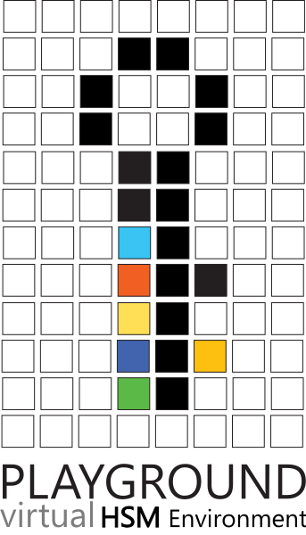

  

# Welcome to playground!

Playground represents a proof of concept platform which emulates an virtual ecosystem for a cryptographic hardware which implements PKCS11 standard.  
> Technologies stack used for deployment: Windows, .NET 6, MSVC

# Platform structure
Project is organised in 3 interoperable components which operates individually.

|Component name								 |Description                  |
|-------------------------------|-----------------------------|
|`Configurator`            	  |Constitues an GUI application which can be used to configure the platform            |
|`Library`           						|Represents the pkcs11 dll file which is consumed by any client which will use the platform           |
|`Service`											|Represents a service that exposed the token functionality|

The `Deploy` directory contains scripts used to generate platform libraries and executables.

# Architecture
